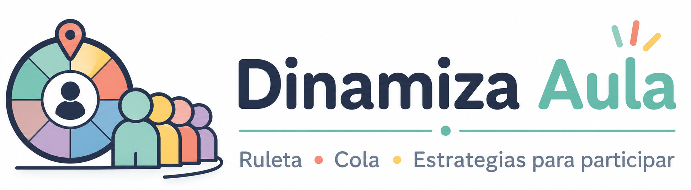

<div align="center">
  
  <p><strong>Kit de dinamización del aula</strong></p>
  <p>
    <a href="https://sergarb1.github.io/DinamizaAula/">
      
    </a>
    <a href="https://github.com/sergarb1/DinamizaAula/blob/main/README.md">
      
    </a>
    
    
    
  </p>
  <p>
    <strong>18 estrategias inteligentes &middot; 6 dinámicas visuales &middot; 100% local y privado</strong>
  </p>
  <p><em>No es una ruleta. Es una colección de estrategias para gestionar la participación de forma justa, divertida y configurable.</em></p>
</div>

---

## 🚀 En un clic

Sin registro, sin instalación, sin servidor.

| | |
|---|---|
| **🌐 Web** | [sergarb1.github.io/DinamizaAula](https://sergarb1.github.io/DinamizaAula/) |
| **📱 PWA** | Abre la web → "Instalar" en el menú del navegador |
| **💻 Local** | `git clone` + `npm install` + `npm run dev` |

---

## ✨ Funcionalidades

<details open>
<summary><strong>🎯 Selección</strong></summary>

| | |
|---|---|
| 🎲 | **18 estrategias de selección**: aleatorio, compensado, justicia total, tímido, valiente, modo torneo, cola inteligente y más |
| 🎡 | **6 dinámicas visuales**: ruleta adaptativa, sorteo rápido, cartas, cola, equipos, desafío |
| ⏱️ | **Auto-selección** con cuenta atrás configurable |
| 🔁 | **Re-sortear cola** y **Reorganizar equipos** en un clic |
| 🎛️ | **Selector de estrategia** integrado en cada mecánica |

</details>

<details>
<summary><strong>👨‍🎓 Gestión de alumnado</strong></summary>

| | |
|---|---|
| 📝 | **CRUD completo**: añadir, editar, eliminar alumnos |
| 📁 | **Grupos** y colores personalizados por alumno |
| ✅ | Alumnos **activos/inactivos** (participan o no) |
| 📥 | **Importar/Exportar** JSON completo |
| 🎨 | **Edición inline** con doble clic |

</details>

<details>
<summary><strong>🏆 Gamificación</strong></summary>

| | |
|---|---|
| ⭐ | **Estrellas** por participación |
| 🔥 | **Rachas** consecutivas (se reinician tras 1 día) |
| 📈 | **XP y niveles** (10 XP por participación, 25 XP por insignia) |
| 🏅 | **9 insignias**: Primer paso → Imparable (150 participaciones) |
| 🏆 | **Ranking** top 5 alumnos en logros |
| ⚙️ | **Toggle** para activar/desactivar gamificación |

</details>

<details>
<summary><strong>📊 Estadísticas</strong></summary>

| | |
|---|---|
| 📊 | **Gráfico de barras** de participaciones por alumno |
| 🥧 | **Gráfico donut** de distribución por grupos |
| 📅 | **Mapa de calor** de actividad (últimos 14 días) |
| ⚖️ | **Índice de equidad** (Gini) con valoración automática |
| 📋 | **Historial** de últimas participaciones |

</details>

<details>
<summary><strong>🔒 Privacidad y técnica</strong></summary>

| | |
|---|---|
| 🔒 | **100% local**: datos en localStorage, nunca salen del navegador |
| 📱 | **PWA instalable** con soporte offline |
| 🌙 | **Modo oscuro/claro** (persistente, respeta prefers-color-scheme) |
| 🖥️ | **Pantalla completa** para proyectar en clase |
| 🌐 | **Sin servidores**, sin cookies, sin registro |
| ✅ | **RGPD y LOPDGDD** compliant |

</details>

---

## 🛠️ Stack técnico

| Frontend | Estado | Build | Despliegue |
|---|---|---|---|
| **Vue 3** + TypeScript 6 | Pinia (localStorage) | **Vite 8** | **GitHub Pages** |
| **Tailwind CSS 4** | Vue Router (hash) | vue-tsc + vite build | Push → Actions → deploy |
| **@vueuse/core** + **@heroicons/vue** | Service Worker (Workbox) | Node 24 | PWA offline-ready |
| **Outfit + Inter** (Google Fonts) | vite-plugin-pwa | `npm run build` → `dist/` | |

---

## 📁 Estructura

```
DinamizaAula/
├── src/
│   ├── main.ts              ← Entry point
│   ├── App.vue              ← Root component
│   ├── style.css            ← Tailwind 4 + estilos globales
│   ├── router/index.ts      ← 6 rutas (hash history)
│   ├── stores/              ← 5 stores Pinia (students, history, settings, challenges, gamification)
│   ├── strategies/          ← 18 estrategias de selección + registry + utils
│   ├── components/
│   │   ├── layout/          ← AppHeader, AppFooter
│   │   ├── mechanics/       ← 3 mecánicas visuales (RouletteWheel, QuickPick, CardDeck)
│   │   ├── shared/          ← Confetti, InstallPrompt, GamificationBar, etc.
│   │   ├── stats/           ← BarChart, DonutChart, TimelineChart (SVG)
│   │   └── settings/        ← SelectionTimer
│   ├── types/               ← Interfaces TS (student, strategy, history)
│   ├── utils/               ← sounds.ts, examples.ts
│   └── views/               ← 6 vistas (Home, Students, Mechanics, MechanicDetail, Statistics, Settings)
├── public/                  ← PWA icons, favicon, apple-touch-icon
├── logo.png                 ← Logo horizontal
├── AGENTS.md                ← Guía para asistentes IA
├── AGPL-3.0-or-later.txt    ← Licencia
└── .github/workflows/deploy.yml ← CI/CD
```

---

## 🤖 Uso con IA

Exporta tus datos como JSON y comparte con cualquier asistente de IA.

**📊 Analizar participación:**
```text
Tengo estos datos de participación en formato JSON:
[copia el JSON exportado desde Dinamiza Aula]

1. ¿Qué alumnos participan menos de lo esperado?
2. ¿Hay algún grupo descompensado?
3. ¿Qué estrategias recomiendas para mejorar la equidad?
```

**📝 Configurar una clase:**
```text
Genera un JSON para importar en Dinamiza Aula con una clase de [nivel].
Mínimo 8 alumnos, con nombres, colores y grupos variados.
Devuelve solo JSON válido, sin explicaciones.
```

---

## 📄 Licencia

**Código:** AGPL v3 — Ver archivo [AGPL-3.0-or-later.txt](AGPL-3.0-or-later.txt)  
**Documentación:** CC BY-SA 4.0  
**Creado por:** [Sergi García Barea](https://github.com/sergarb1)

---

## 🔗 Enlaces

- [🌐 Web](https://sergarb1.github.io/DinamizaAula) — pruébalo ahora
- [🎓 Proyecto](https://mejoratudocencia.es) — mejoratudocencia.es
- [🐙 GitHub](https://github.com/sergarb1/DinamizaAula) — código fuente
- [🐛 Issues](https://github.com/sergarb1/DinamizaAula/issues) — reporta bugs o sugiere mejoras

---

<div align="center">
  <sub>Hecho con ❤️ para docentes que quieren dinamizar sus clases.</sub>
  <br>
  <sub>100% gratuito &middot; RGPD compliant &middot; datos siempre locales</sub>
</div>
